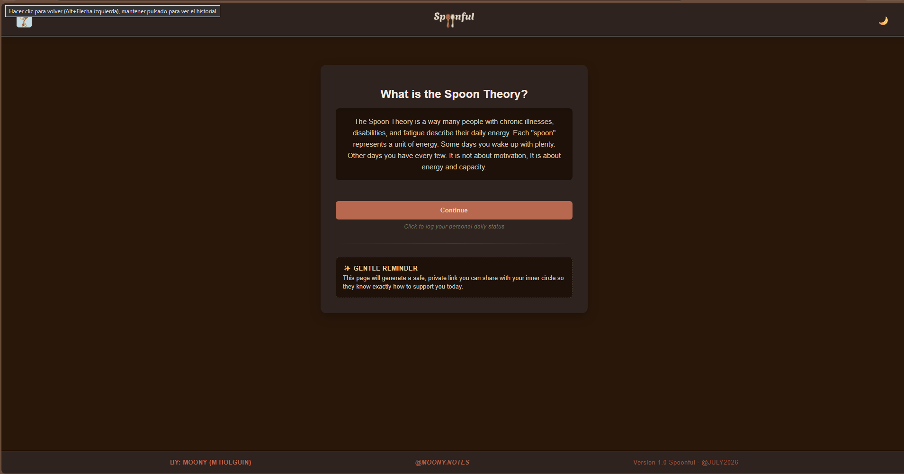
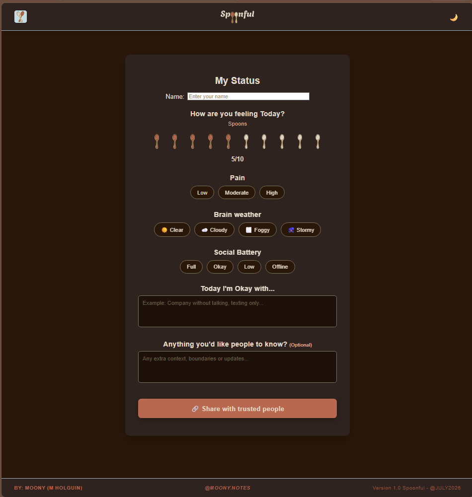
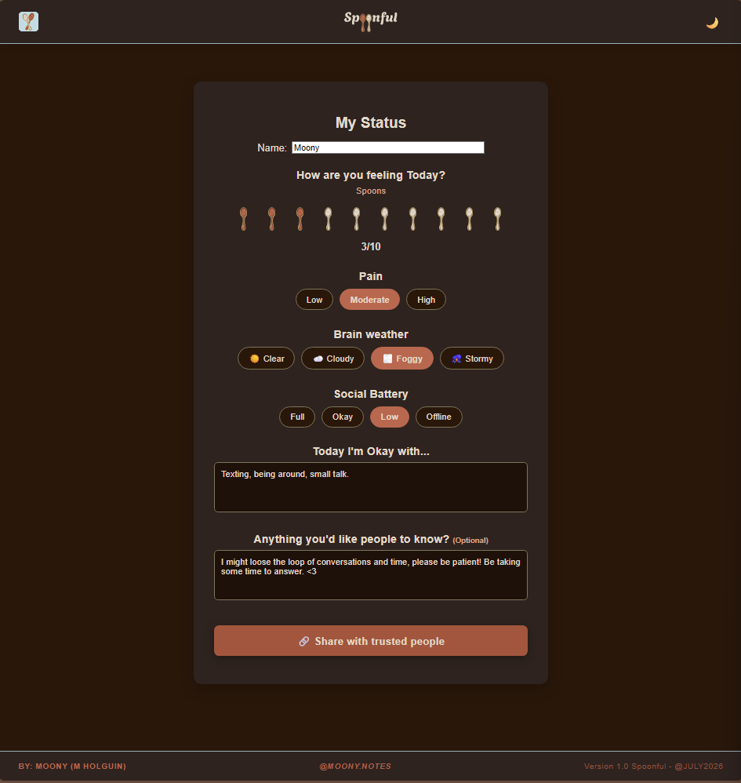
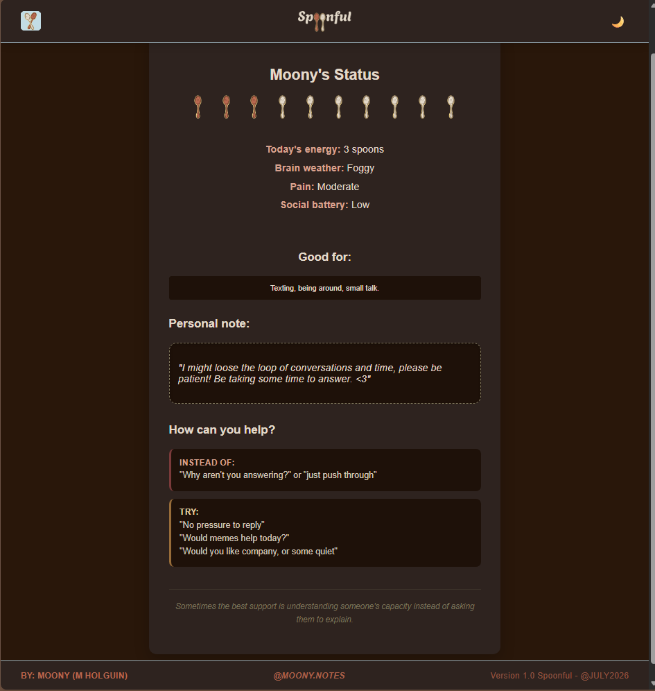

## Spoonful
*A gentle way to share how you're doing today.*

Spoonful is a small web application inspired by the **Spoon Theory**,
a concept widely used withing chronic illness and disability community to describe how limited daily energy can be.

Living with an invisible disability often means repeating the same conversations over and over:

*"I'm not ignoring you."*

*"I'm just exhausted."*

*"I'd love to, I just don't have the energy."*

Spoonful aims to make those conversations a little easier.

Instead of having to explain your capacityevery day, users can fill out a simple status page, generate a shareable view, and let the people they trust better understand how they're feeling and how they can best offer support.

This is the prototype of a project that Ihope to continue developing in the future.
 
 # Why I built this

 I'm 17 years old, and I live with chronic pain and fatigue myself.

 This project comes from a very personal place. For months I'd been thinking about creating something around Spoon Theory, but never quite knew where to begin (or I was to busy to do so). Hack Club's Macondo challenge finally gave me the push to turn that idea into something real.

 Coincidentially, I also built this during **Disability Pride Month**, which makes this version feel even more meaningful to me.

---------------------------------

 ## Features

 # Landing page

 A simple introduction to spoon Theory and the purpose of Spoonful, including a gentle explanation for people discovering the concept for the first time.

# Screenshot

 

--------------------------------------------

 # My status

 An interactive page where users can communicate their current capacity by selecting:

 - Spoon count
 - Pain level
 -  weather (mental clarity/focus/capacity)
 - Social battery
 - Activities they're comfortable with today
 - An optional personal note

 The goal is to express today's realities without needing to type the same explanation repeteadly.

 # Screenshot

 

 ----------------------------------------
 
 # Trusted Circle View

 A clean, easy to read page designed for friends and family.

 Rather than only displaying someone's status it also offers gentle suggestions for supportive communication, encouraging understanding instead of asumptions.

 # Screenshot

-----------------------------------

## Design Philosophy ##

One design principle guided every decision throughout this project:

*Comfort over clinical*
I didn't want Spoonful to feel like a medicla dashboard.

I wanted it to feel calm, warm and safe.

The interface draws inspiration from cozy minimalism, using warm chocolate browns, muted creams, earthy ochres and soft clay accents to reduce visual harshness while remaining accesible and comfortable to read. 
(althought this is technically just the dark mode version)

Even the spoon illustrations were drawn specifically for this project to create a softer, more personal identity.

---------------------------------------------

# Built With

- HTML
- CSS
- Vanilla JavaScript

No frameworks, no libraries, just the fundamentals.

-------------------------------------

## DEVELOPMENT

Total development before writing the READ.ME was around **13.6 hours**

Approximate breakdown:
- Planning and wireframing: **1.6 hours**
- Custom illustrations & assets: **0.7 hours**
- Fronted development & UI polish: **11.3 hours**

Most of those coding hours happened in long creative flow state. While I definitely paid for it physically afterwards (chronic pain doesnt negotiate, nor brain fog does), I'm incredibly proud of how much this first prototype became in such a short amount of time.

# AI Usage Declaration

AI was used as a learning and brainstorming tool throught the development of Spoonful.

Specifically, I used AI to:

- Clarify HTML, CSS, and Java Scripts while learning.
- Debug parts of my code and understanding WHY solutions worked.
- Brainstorming implementations ideas and simplify technical decisions
- Referencing structure for documentation.

All project decisions, the original concept, user experience, interface design, illustrations, wireframes, visual identity and overall direction were created by me.

Spoonful is a project born from my own experiences and motivation to create a gentler way for people with invisible disabilities and chronic illnesses to communicate their daily capacity. AI supported the learning process, but the idea, design vision and final implementation remaind my own.

**Personal note:** Because I live with chronic pain and fatigue, brain fog can sometimes make me get stuck in the same thought loops or lose track of ideas while working. Brainstorming with AI helped me externalize those thoughts, organize them, and continue making progress. For me, it functioned as a thinking partner rather than a replacement for my own creativity or decision-making.

-----------------------------

# What's Next

This is only Version 1.

Some ideas I'd love to explore in future iterations include:

- Persistent shareable links
- Trusted contacts
- Better accesibility options
- More personalization
- Improved responsive layouts
- Additional communciaiton tools for invisible disabilities

Long-term,I'd love for Spoonful to become part of a alrger project supporting people with invisible disabilities and chronic illnesses.

--------------------------

# A small note
If Spoonful helps even one person explain, "This is where Im' at Today," without feeling like thet have to jsutify themselves all over again, then building it was worth it.
